<h1 align="center">${\color{red}\text{WELCOME}}$</h1>

  

___

<h2 align=center>👨‍💻 Info</h2>

  

<h2 align=center> 🛠️ My Stack</h2>

  
  
  

<h2 align=center>📚 Learning </h2>

  
  
  

<h2 align=center> 📬 Social contacts</h2>

  
    
  

